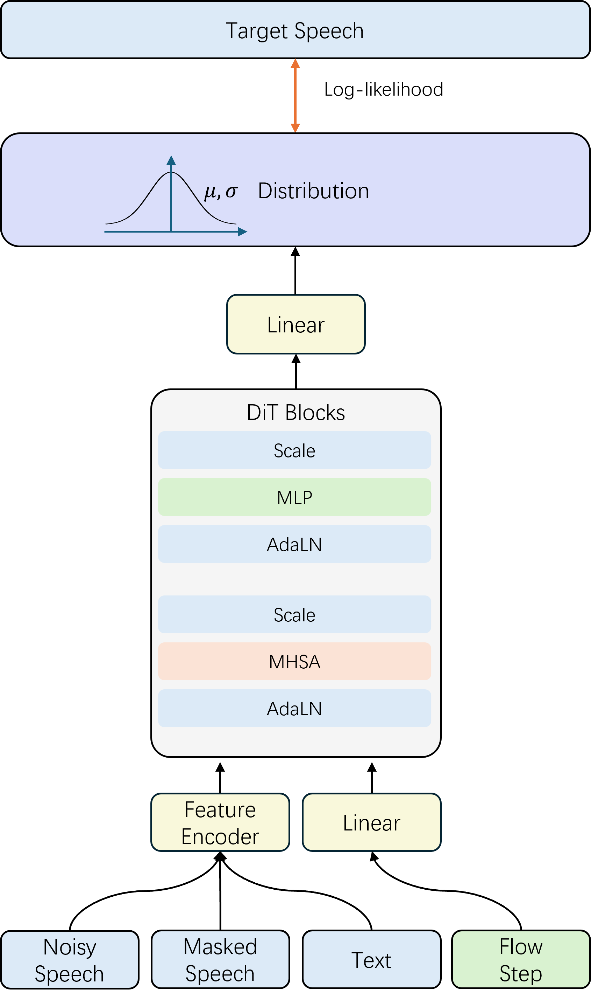
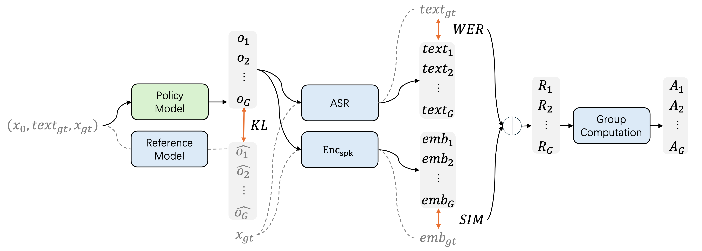

# F5R-TTS: Improving Flow-Matching based Text-to-Speech with Group Relative Policy Optimization

[](https://github.com/shaw0fr/F5R-TTS)
[](https://arxiv.org/abs/2504.02407)
[](https://frontierlabs.github.io/F5R/)

We present F5R-TTS, a novel text-to-speech (TTS) system that integrates  Group Relative Policy Optimization (GRPO) into a flow-matching based  architecture. By reformulating the deterministic outputs of  flow-matching TTS into probabilistic Gaussian distributions, our  approach enables seamless integration of reinforcement learning  algorithms. During pretraining, we train a probabilistically  reformulated flow-matching based model which is derived from F5-TTS with  an open-source dataset. In the subsequent reinforcement learning (RL)  phase, we employ a GRPO-driven enhancement stage that leverages dual  reward metrics: word error rate (WER) computed via automatic speech  recognition and speaker similarity (SIM) assessed by verification  models. Experimental results on zero-shot voice cloning demonstrate that  F5R-TTS achieves significant improvements in both speech  intelligibility (relatively 29.5% WER reduction) and speaker similarity  (relatively 4.6% SIM score increase) compared to conventional  flow-matching based TTS systems. Audio samples are available at [demo](https://frontierlabs.github.io/F5R/).
<br>

<div align="center">
<br>
<figcaption>Fig 1: The architecture of backbone.</figcation>
</div>

<br>

<div align="center">
<br>
<figcaption>Fig 2: The pipeline of GRPO phase.</figcation>
</div>

<br>


## Installation

```bash
# Create a python 3.10 conda env (you could also use virtualenv)
conda create -n f5r-tts python=3.10
conda activate f5r-tts

# Install pytorch with your CUDA version, e.g.
pip install torch==2.3.0+cu118 torchaudio==2.3.0+cu118 --extra-index-url https://download.pytorch.org/whl/cu118
```

Then you can choose from a few options below:

### 1. As a pip package (if just for inference)

```bash
pip install git+https://github.com/shaw0fr/F5R-TTS
```

### 2. Local editable (if also do training, finetuning)

```bash
git clone https://github.com/shaw0fr/F5R-TTS
cd F5R-TTS
# git submodule update --init --recursive  # (optional, if need bigvgan)
pip install -e .
```

If initialize submodule, you should add the following code at the beginning of `src/third_party/BigVGAN/bigvgan.py`.

```python
import os
import sys
sys.path.append(os.path.dirname(os.path.abspath(__file__)))
```

## Inference

```bash
python ./src/f5_tts/infer/infer_cli.py \
--model F5-TTS \
--ckpt_file "your_model_path" \
--ref_audio "path_to_reference.wav" --ref_text "reference_text" \
--gen_text "generated_text" \
--output_dir ./tests
```

## Training

You can download [SenseVoice_small](https://huggingface.co/FunAudioLLM/SenseVoiceSmall) and [wespeaker](https://wenet.org.cn/downloads?models=wespeaker&version=cnceleb_resnet34.zip) for GRPO phase.
```bash
accelerate config

# Data preparing
python src/f5_tts/train/datasets/prepare_emilia.py

# Pretraining phase
accelerate launch rc/f5_tts/train/train.py

# GRPO phase
accelerate launch rc/f5_tts/train/train_rl.py
```

## [Evaluation](src/f5_tts/eval)

## Acknowledgements

- [F5-TTS](https://arxiv.org/abs/2410.06885) backbone of our work
- [E2-TTS](https://arxiv.org/abs/2406.18009) brilliant work, simple and effective
- [Emilia](https://arxiv.org/abs/2407.05361), [WenetSpeech4TTS](https://arxiv.org/abs/2406.05763) valuable datasets
- [lucidrains](https://github.com/lucidrains) initial CFM structure with also [bfs18](https://github.com/bfs18) for discussion
- [SD3](https://arxiv.org/abs/2403.03206) & [Hugging Face diffusers](https://github.com/huggingface/diffusers) DiT and MMDiT code structure
- [torchdiffeq](https://github.com/rtqichen/torchdiffeq) as ODE solver, [Vocos](https://huggingface.co/charactr/vocos-mel-24khz) as vocoder
- [FunASR](https://github.com/modelscope/FunASR), [faster-whisper](https://github.com/SYSTRAN/faster-whisper), [UniSpeech](https://github.com/microsoft/UniSpeech) for evaluation tools
- [ctc-forced-aligner](https://github.com/MahmoudAshraf97/ctc-forced-aligner) for speech edit test

## Citation

If our work and codebase is useful for you, please cite as:

```
@article{sun2025f5r,
  title={F5R-TTS: Improving Flow-Matching based Text-to-Speech with Group Relative Policy Optimization},
  author={Sun, Xiaohui and Xiao, Ruitong and Mo, Jianye and Wu, Bowen and Yu, Qun and Wang, Baoxun},
  journal={arXiv preprint arXiv:2504.02407},
  year={2025}
}
```

## License

Our code is released under MIT License.

